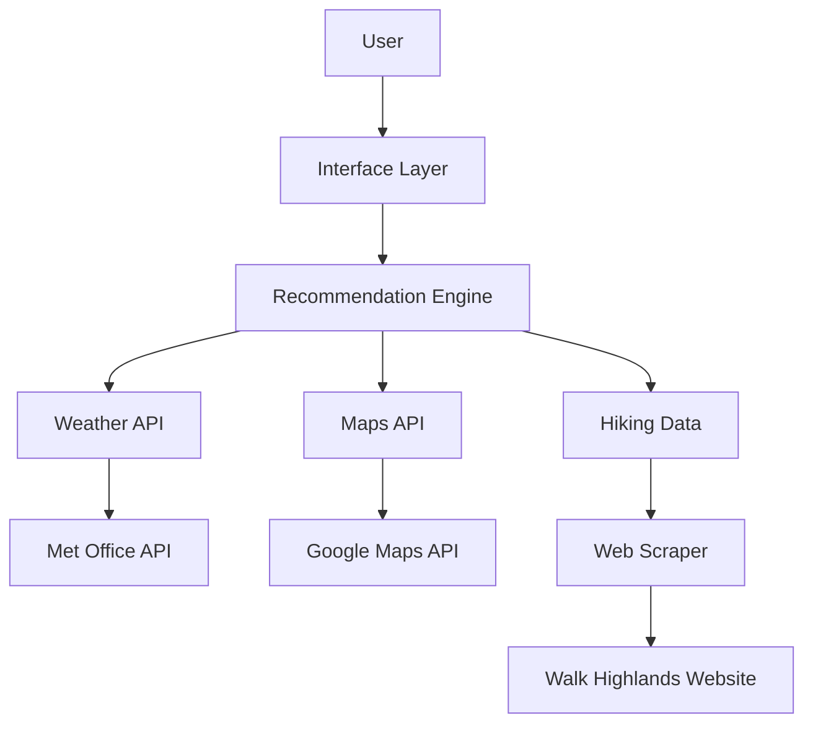

# Scotland Trip Planner - Architecture Design

## System Overview

The Scotland Trip Planner is designed to help users find ideal locations for weekend trips in Scotland based on weather forecasts, driving distances, and hiking routes. The system follows a modular architecture with clear separation of concerns between data collection, processing, and recommendation generation.

## Core Components

### 1. Data Collection Layer

This layer is responsible for gathering data from various sources:

#### 1.1 Weather API Module (`src/api/weather.py`)
- Interfaces with the Met Office Weather Data API
- Retrieves weather forecasts for specific locations and date ranges
- Handles API authentication, rate limiting, and error handling
- Provides a clean interface for the rest of the application

#### 1.2 Maps API Module (`src/api/maps.py`)
- Interfaces with the Google Maps API
- Calculates driving distances and times between locations
- Provides route planning functionality
- Handles API authentication and error handling

#### 1.3 Hiking Data Module (`src/data/hiking_routes.py`)
- Scrapes hiking route information from Walk Highlands website
- Processes and normalizes the data
- Stores route information including difficulty, length, elevation, etc.
- Periodically updates the data to ensure freshness

### 2. Data Model Layer

This layer defines the data structures used throughout the application:

#### 2.1 Location Model (`src/models/location.py`)
- Represents geographical locations in Scotland
- Stores coordinates, region information, and nearby amenities
- Provides methods for distance calculations and location comparison

#### 2.2 Weather Model (`src/models/weather.py`)
- Represents weather forecasts for specific locations and times
- Includes temperature, precipitation, wind, and other weather metrics
- Provides methods for weather condition evaluation and comparison

#### 2.3 Route Model (`src/models/route.py`)
- Represents hiking routes
- Stores route details, difficulty, length, elevation profile, etc.
- Provides methods for route evaluation and filtering

#### 2.4 Recommendation Model (`src/models/recommendation.py`)
- Represents trip recommendations
- Combines location, weather, and route information
- Includes scoring and ranking information

### 3. Recommendation Engine Layer

This layer processes the collected data and generates recommendations:

#### 3.1 Planner Module (`src/engine/planner.py`)
- Coordinates the recommendation process
- Manages the flow of data between components
- Handles user preferences and constraints

#### 3.2 Scoring Module (`src/engine/scoring.py`)
- Implements algorithms for scoring locations based on various factors
- Considers weather conditions, driving distance, route suitability, etc.
- Provides configurable scoring parameters

#### 3.3 Recommendations Module (`src/engine/recommendations.py`)
- Generates final recommendations based on scores
- Filters and ranks recommendations
- Formats recommendations for presentation

### 4. Utility Layer

This layer provides helper functions and utilities:

#### 4.1 Geospatial Utilities (`src/utils/geo.py`)
- Provides functions for geospatial calculations
- Handles coordinate transformations and distance calculations
- Implements geofencing and region detection

#### 4.2 Date Utilities (`src/utils/date_utils.py`)
- Provides functions for date and time handling
- Manages date ranges, weekends, and holidays
- Handles timezone conversions

### 5. Web Interface Layer (Optional)

This layer provides a user-friendly web interface:

#### 5.1 Flask Application
- Implements a web server using Flask
- Renders HTML templates with Jinja2
- Handles user input and form submission

#### 5.2 Frontend
- Implements responsive UI with HTML, CSS, and JavaScript
- Displays recommendations in an intuitive format
- Provides interactive maps and weather visualizations

## Data Flow

1. User inputs preferences (location, date range, activity preferences)
2. System retrieves weather forecasts for potential locations
3. System calculates driving distances from user's starting point
4. System filters hiking routes based on user preferences and weather conditions
5. Recommendation engine scores each potential location
6. System presents top recommendations to the user

## Recommendation Algorithm

The recommendation engine uses a weighted scoring system that considers:

1. Weather suitability (40%)
   - Temperature within optimal range
   - Low precipitation probability
   - Acceptable wind conditions
   - Good visibility

2. Accessibility (30%)
   - Driving distance within user's preferred range
   - Road conditions and traffic considerations
   - Public transport options (if applicable)

3. Activity suitability (30%)
   - Hiking routes matching user's preferences
   - Route difficulty appropriate for user's experience
   - Scenic value and points of interest
   - Availability of amenities (parking, facilities, etc.)

The scoring algorithm can be customized through configuration parameters to adjust the weights and thresholds.

## Future Expansion

The modular architecture allows for easy expansion in several directions:

1. Additional data sources:
   - Accommodation availability and pricing
   - Public transport schedules
   - Local events and attractions
   - User reviews and ratings

2. Enhanced recommendation features:
   - Multi-day trip planning
   - Group trip recommendations
   - Seasonal specialties
   - Personalized recommendations based on user history

3. Advanced interface options:
   - Mobile application
   - Email notifications for ideal conditions
   - Calendar integration
   - Social sharing features

## Implementation Considerations

1. **API Rate Limiting**: Implement proper caching and rate limiting to avoid exceeding API quotas, especially for the Met Office and Google Maps APIs.

2. **Data Freshness**: Establish appropriate update frequencies for different data types (e.g., weather data needs frequent updates, hiking route data can be updated less frequently).

3. **Error Handling**: Implement robust error handling throughout the application, especially for external API calls and web scraping.

4. **Testing Strategy**: Develop comprehensive unit tests for each module, with mock objects for external dependencies to enable isolated testing.

5. **Configuration Management**: Use environment variables and configuration files to manage API keys, default settings, and user preferences.

6. **Scalability**: Design the system to handle multiple concurrent users if deployed as a web service.

## Conclusion

The Scotland Trip Planner architecture provides a solid foundation for building a useful tool for planning weekend trips in Scotland. The modular design allows for incremental development and future expansion, while the separation of concerns ensures maintainability and testability.